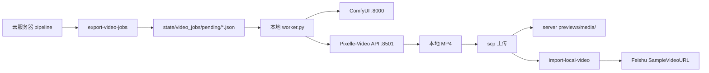

# Local GPU Video Rendering (ComfyUI + Pixelle-Video)

Use your Windows PC (RTX 4070) to render high-quality short videos locally, then push them to the server for online preview and Feishu links.

## Architecture



## Server setup

1. Enable local GPU mode in `automation/config.json`:

```json
"local_gpu": {
  "enabled": true,
  "auto_export_on_plan_day": true,
  "pixelle_api_url": "http://127.0.0.1:8501",
  "comfyui_url": "http://127.0.0.1:8000",
  "upload": {
    "server_host": "YOUR_SERVER_IP",
    "remote_media_dir": "/opt/fa/automation/previews/media"
  }
}
```

2. Export jobs after `plan-day` or manually:

```bash
python3 automation/pipeline.py --config automation/config.json export-video-jobs --date 2026-07-03 --only-pending --sync-feishu
python3 automation/pipeline.py --config automation/config.json list-video-jobs
```

When `local_gpu.enabled=true`, `render-samples` will **not** use server ffmpeg TTS. It exports jobs instead.

## Windows one-click setup (recommended)

Server deploy bundle is served at:

`http://118.25.178.116:8787/local-gpu-deploy/`

On your Windows PC, open **PowerShell** and run:

```powershell
powershell -ExecutionPolicy Bypass -Command "Invoke-WebRequest http://118.25.178.116:8787/local-gpu-deploy/setup_windows.ps1 -OutFile $env:TEMP\setup_windows.ps1; powershell -ExecutionPolicy Bypass -File $env:TEMP\setup_windows.ps1"
```

| 服务 | 端口 | 说明 |
|------|------|------|
| ComfyUI | **8000** | 图像/视频生成 |
| Pixelle Web UI | **8501** | Streamlit 网页（不能给 worker 调 API） |
| Pixelle REST API | **8502** | FastAPI，worker 必须连这个 |

After setup, double-click `D:\content-ops\scripts\start_worker.bat` for daily runs.

## Manual Windows setup

### Prerequisites

1. **ComfyUI** running at `http://127.0.0.1:8000`
2. **Pixelle-Video** API running at `http://127.0.0.1:8501`

   ```bash
   uv run uvicorn api.app:app --host 0.0.0.0 --port 8501
   ```

3. OpenSSH client (`scp` / `ssh`) available in PowerShell or Git Bash
4. SSH key access to your server (recommended)

### Configure local worker

```bash
copy automation\local_gpu\local_config.example.json automation\local_gpu\local_config.json
```

Edit paths:

- `jobs_dir`: local folder for pending jobs, e.g. `D:/content-ops/video_jobs`
- `output_dir`: where rendered MP4 files are saved locally
- `pull_jobs_from_server.enabled`: auto-download pending jobs from server
- `upload`: server host + remote paths

### Run worker

One-shot:

```bash
python automation/local_gpu/worker.py --config automation/local_gpu/local_config.json --once
```

Continuous polling:

```bash
python automation/local_gpu/worker.py --config automation/local_gpu/local_config.json
```

The worker will:

1. Pull pending job JSON files from server (optional)
2. Call Pixelle-Video API with your script (`mode=fixed` by default)
3. Save MP4 locally
4. Upload to server via `scp`
5. Run remote `import-local-video --sync-feishu`

## Manual import (optional)

If you only want local files and manual upload:

```bash
# On server after copying MP4 to previews/media/YYYY-MM-DD/<id>.mp4
python3 automation/pipeline.py --config automation/config.json import-local-video --id <queue_id> --sync-feishu
```

Or specify a path explicitly:

```bash
python3 automation/pipeline.py --config automation/config.json import-local-video --id <queue_id> --video-path /path/to/video.mp4 --sync-feishu
```

## Recommended Pixelle-Video workflows (4070)

| Setting | Suggested value |
|---|---|
| `tts_workflow` | `tts_edge.json` (clear Chinese voice) |
| `media_workflow` | `image_flux.json` or `video_wan2.1.json` |
| `frame_template` | `1080x1920/image_default.html` |
| `mode` | `fixed` (use server script as-is) |

Adjust `media_workflow` based on models you have installed in ComfyUI.

## Troubleshooting

| Issue | Check |
|---|---|
| Pixelle API connection refused | Start API on port 8501 |
| ComfyUI workflow fails | Open ComfyUI, load `workflows/selfhost/analyse_image.json` first |
| scp upload fails | Test `ssh root@YOUR_SERVER_IP`, verify key and firewall |
| Video not in portal | Run `import-local-video` and hard refresh (`Ctrl+F5`) |
| Subtitle garbled | Local Pixelle TTS (`tts_edge.json`) replaces server espeak/ffmpeg path |
